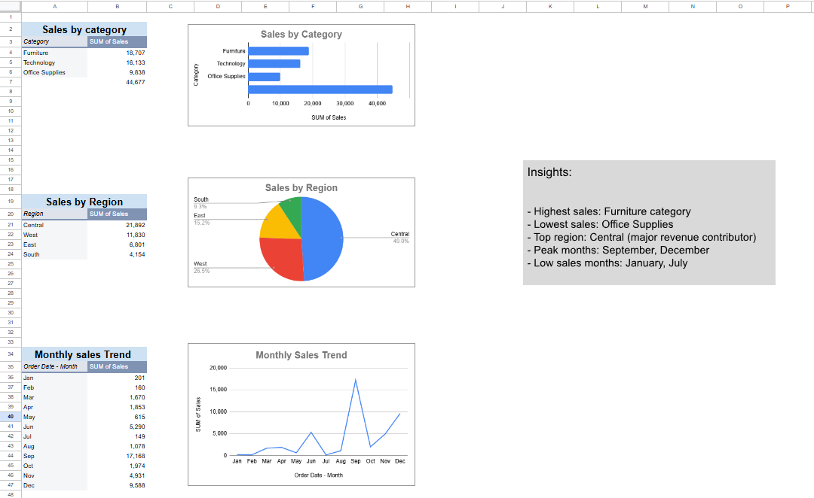

# Sales Analysis Dashboard (Excel)

## Overview
This project presents a sales analysis dashboard built using Microsoft Excel. It focuses on analyzing transactional sales data to extract meaningful business insights using formulas, pivot tables, and visualizations.

---

## Objectives
- Analyze overall sales performance
- Identify top and low-performing categories
- Segment transactions based on sales value
- Understand sales trends over time

---

## Dataset
- Sample Superstore dataset
- Contains order-level data including:
  - Order Date
  - Category
  - Region
  - Sales

## Project Structure
 The Excel file contains:
- *Raw_Data sheet* → original dataset with added columns (Month, Sales Level)  
- *Analysis sheet* → calculations using formulas (IF, COUNTIF, SUMIF)  
- *Dashboard sheet* → pivot tables, charts, and insights  

---

## Features

### KPI Summary
- Total Sales
- Average Order Value
- Total Orders

### Sales Analysis
- Sales classification using *IF function*
- High vs Low sales distribution using *COUNTIF*
- Category-wise revenue using *SUMIF*

### Pivot Table Analysis
- Monthly sales trend using Pivot Table
- Time-based performance visualization

---

## Key Insights
- Furniture is the highest revenue-generating category  
- Office Supplies contributes the least to total sales  
- Majority of transactions fall under low-value sales  
- Sales fluctuate across months with noticeable peak periods  
- High-value transactions are fewer but contribute significantly to revenue  

---

## Tools & Techniques Used
- Microsoft Excel / Google Sheets  
- Functions:
  - IF  
  - SUMIF  
  - COUNTIF  
  - SUM  
  - AVERAGE  
- Pivot Tables  
- Data Visualization (Charts)

---

## Dashboard Preview

---

## Conclusion
This project demonstrates the use of Excel for data analysis by combining data cleaning, formula-based calculations, and visualization techniques to derive actionable insights.

---
---

